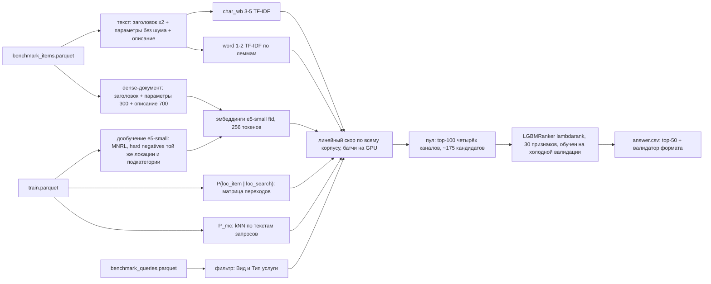

# Авито: кандидатогенерация для поиска услуг (Recall@50)

Для каждого запроса бенчмарка (`benchmark_queries.parquet`, 2 452 шт.) нужно вернуть до 50 уникальных объявлений из корпуса (`benchmark_items.parquet`, 189 212 шт.). Метрика — Recall@50: доля релевантных объявлений запроса, попавших в top-50, усреднённая по запросам. Обучающие данные — `train.parquet`, 497 673 пары «запрос → выбранное объявление».

## Результат

**Лидерборд: Recall@50 = 0,8963** (сабмит s10, финальный). Рецепт s10 воспроизводится одной командой `bash scripts/run_all.sh --clean` — см. «Как воспроизвести».

| сабмит | что | холодная валидация | лидерборд |
|---|---|---|---|
| s3 | линейное слияние источников (этап 4) | 0,8967 | 0,8801 |
| s6 | + LightGBM-ранкер пула, обучен на тёплой валидации (этап 5) | 0,9196 | 0,8912 |
| s9 | «чистый» ранкер: обучен на холодной валидации, без признаков истории и «качества» объявления | 0,9154 | 0,8917 |
| **s10** | **s9 + dense-модель, дообученная на тексте с описанием объявления** | **0,9235** | **0,8963** |

«Холодная» валидация (`ctx_cold`) появилась после первых сабмитов: исходная («тёплая») завышала результат на 4–5 п.п. Разбор — в разделе «Валидация и лидерборд».

Путь по этапам ТЗ на исходной («тёплой») валидации (метрика `bench_adj`, см. «Валидация»):

| этап | что добавлено | bench_adj | Δ, п.п. | weighted |
|---|---|---|---|---|
| 2 | baseline из ТЗ: char TF-IDF + P_loc + фильтр + P_mc | 0,8437 | — | 0,8542 |
| 2 | очистка параметров от шума, описание объявления целиком | 0,8731 | +2,94 | 0,8820 |
| 2 | + word TF-IDF по леммам, подбор весов Optuna | 0,8852 | +1,21 | 0,8906 |
| 3 | + dense (USER-base), doc expansion, подбор весов | 0,9095 | +2,43 | 0,9151 |
| 4 | dense → e5-small, дообученный на кликах train | 0,9177 | +0,82 | 0,9232 |
| 5 | LightGBM-предранкер пула кандидатов | 0,9377 | +1,99 | 0,9423 |

Все эксперименты, включая неудачные, — в `EXPERIMENTS.md`. EDA — в `reports/eda.md`. Разбор результатов по запросам — `reports/demo.html`.

## Схема пайплайна



## Как это работает

### Валидация

Бенчмарк собран из запросов с конкретным контекстом поиска. Валидация повторяет эту структуру (`src/candgen/validation.py`):

- **Группа** — строки train с одинаковым полным контекстом: нормализованный текст, локация, фильтр, доставка, категория. Это аналог одного `query_id`. Релевантные — выбранные в группе объявления, которые есть в корпусе (у 97% групп такое объявление ровно одно).
- **unseen-срез** (5 000 текстов): для текста случайно выбирается одна группа, а **все** строки этого текста удаляются из train.
- **seen-срез** (1 500 текстов): откладывается одна группа, остальные группы текста остаются.
- **Приоры, память и expansion на валидации считаются только по остатку train.** Дообученная модель для валидации тоже учится только на остатке.
- **Холодный вариант `ctx_cold`** (основной для итогового рецепта): из остатка дополнительно удалены все строки с релевантными объявлениями валидации, как будто их никогда не кликали. Зачем — в разделе «Валидация и лидерборд».
- **Метрика решений `bench_adj`** — recall@50 по 4 ячейкам (seen/unseen × фильтр есть/нет) с весами, вычисленными из `benchmark_queries` (0,210 / 0,164 / 0,159 / 0,466). Фильтр есть у 67% строк train, но только у 37% запросов бенчмарка; без перевзвешивания бонус за фильтр переоценивается.
- **Честность подбора весов.** Веса подбираются на половине A валидации, прирост проверяется на отложенной половине B. Дополнительно считается recall по объявлениям, встречавшимся и не встречавшимся в train: история train помогает только первым.

### Источники кандидатов

- **Текст объявления** (для лексики): заголовок ×2 + параметры[:400] без служебного шума (график работы, тип стоимости, адрес) + описание целиком. Затем нормализация: нижний регистр, ё→е, только буквы и цифры. Описание целиком вместо первых 300 символов дало +2,6 п.п.
- **char_wb 3–5 TF-IDF** устойчив к опечаткам и склейкам. **word 1–2 TF-IDF** строится по леммам pymorphy3, с кэшем лемм по уникальным словам. Оба источника сделаны на HashingVectorizer: векторизация параллельная, без словаря в памяти, IDF — по корпусу.
- **Dense — multilingual-e5-small, дообученный на кликах train** (`src/candgen/finetune.py`, модель `e5_small_ftd` в конфиге). Документ — заголовок + параметры[:300] + описание[:700], до 256 токенов. Пары «запрос → выбранное объявление» из train; hard negative для пары — другое объявление той же локации и подкатегории. Лосс MNRL, batch 64 (больший не помещается в 8 ГБ при 256 токенах), 1 эпоха, bf16, gradient checkpointing. Обучаются две модели: на холодном остатке train (для признаков ранкера на валидации) и на всём train (для бенчмарка). Без приоров на холодной валидации модель даёт recall@50 0,392 против 0,364 у той же модели на тексте без описания (заголовок + параметры, 128 токенов; этап 4).
- **Doc expansion** (этапы 3–5): объявлению, которое выбирали в train, приписан текст приводивших к нему запросов (до 30 самых частых) — отдельный char TF-IDF источник. **В итоговом решении выключен:** на холодной валидации вредит, а в тесте релевантные объявления в основном новые.

### Приоры

- **P(loc_item | loc_search)** — матрица переходов по кликам train. В 17% запросов бенчмарка у локации поиска нет объявлений в корпусе: это регионы-агрегаты, например «область → областной центр». Поэтому сравнивать локации на равенство нельзя. Вклад в скор: `0.067·log(P + 3e-6)`.
- **P_mc** — распределение подкатегорий по 20 ближайшим текстам запросов train (char 2–4 TF-IDF, kNN на GPU). 86% кликов запроса приходятся на его главную подкатегорию.
- **Фильтр:** по 0,5 за «Вид услуги» и «Тип услуги», если пара «ключ значение» есть в параметрах объявления. У выбранных объявлений она есть в 98% случаев. Значение фильтра обрывается на любом известном ключе (список ключей — в конфиге).

### Скоринг всего корпуса

```
score(q, d) = cos_char + 0.61·cos_word + 0.5·cos_e5ftd
            + 0.067·log(P_loc + 3e-6) + 0.012·log(P_mc + 8.6e-4) + 0.31·bonus_filter
```

Скорится **весь корпус**, а не top-N текстового поиска: объявление может быть 2 000-м по тексту, но единственным в городе запроса. Батч из 512 запросов умножается на корпус на GPU — разреженная TF-IDF матрица корпуса (только признаки, встречающиеся в запросах) и плотные эмбеддинги. К результату прибавляются приоры, затем `torch.topk`. В памяти в каждый момент только B × N скоров. Веса и eps подобраны Optuna (TPE, seed 42) на этапах 2–4; при замене dense-модели и отключении expansion они не переподбирались.

### Предранкер

`src/candgen/prerank.py`:

- **Пул** — объединение top-100 четырёх каналов: итоговый линейный скор и «char / word / dense + приоры». В среднем 175 кандидатов на запрос; релевантное попадает в пул у 96,2% запросов холодной валидации.
- **30 признаков:** сырые значения источников и ранги в каналах, P_loc и P_mc, совпадение «Вид» и «Тип» услуги по отдельности, расстояние, цена и флаги объявления, свойства запроса (длина, фильтр, регион, встречался ли в train, острота P_mc). **Исключены** (`prerank.drop_features`): история объявления в train (популярность, expansion, «память») и его «качество» (отзывы, рейтинг, длины текстов) — см. «Валидация и лидерборд».
- **Модель** — `LGBMRanker` (lambdarank, группа — запрос), 150 деревьев. Число деревьев фиксировано (`prerank.final_n_estimators`): ранний останов по случайным 20% запросов на итоговом обучении срабатывал на 17-м дереве, хотя в фолдах лучшая итерация — 146–155.
- **Обучение — на val-запросах холодной валидации.** Только у них все признаки честные: у запросов остатка train клики уже «вшиты» в P_mc и дообученный e5. Качество оценивается cross-fitting (2 фолда по запросам); для сабмита ранкер учится на всех val-запросах.
- **Результат на холодной валидации:** recall@50 0,9094 (линейное слияние с той же dense-моделью) → **0,9235**.

### Оригинальные фишки (этап 4)

Правило: одна фишка — один эксперимент; в сабмит идёт только прирост ≥ +0,5 п.п. bench_adj.

| фишка | идея | результат |
|---|---|---|
| 7. Дообучение e5-small с hard negatives по локации | контрастивное обучение на кликах; негатив — объявление той же локации и подкатегории | **+0,82 п.п.**, на новых объявлениях +1,4 — **в итоге** |
| 2. Иерархия локаций из данных | P_loc сглаживается гео-ядром: координаты локации = медиана координат её объявлений, K ∝ n_items·exp(−км/σ) | +0,29 (< 0,5) — не вошло |
| 6. «Регион против города» | тип локации определяется по доле кликов в неё саму (бимодально: у городов > 0,6, у регионов ≈ 0); отдельные веса для регионов | вместе с фишкой 2: +0,29 на отложенной половине — не вошло |
| 4. Перенос запросов на похожие объявления | запросы объявлений train переносятся на ближайшие по dense объявления корпуса той же подкатегории | −0,07…−1,2 — не вошло |
| 9. Демо-страница | `reports/demo.html`: запрос → 50 кандидатов с разложением скора по источникам | `python -m candgen.demo` |

## Валидация и лидерборд

| сабмит | тёплая валидация | холодная валидация | лидерборд |
|---|---|---|---|
| s3: линейное слияние (этап 4) | 0,9177 | 0,8967 | 0,8801 |
| s6: предранкер, обучен на тёплой валидации | 0,938 | 0,9196 | 0,8912 |
| s9: «чистый» ранкер, обучен на холодной валидации | — | 0,9154 | 0,8917 |
| **s10: s9 + dense с описанием объявления** | — | **0,9235** | **0,8963** |

Исходная («тёплая») валидация завышает результат, и у ранкера — сильнее. Причина в том, что val-релевантные — это объявления, которые кликали в train:

1. **У 40% из них есть история в остатке train:** doc expansion, популярность, пары при дообучении e5. В тесте релевантные в основном новые. Поэтому добавлен вариант **`ctx_cold`**: из остатка удалены все строки с релевантными объявлениями валидации (1,3% строк), и история у них полностью отсутствует. Холодная валидация ближе к лидерборду: для линейного слияния разрыв −1,7 п.п., а не −3,8. Doc expansion на ней вредит.
2. **Смещение «выживших» объявлений.** Val-релевантные — объявления, которые кликали в период train и которые до сих пор активны. У них в 3 раза больше отзывов, чем у типичного объявления корпуса (медиана 42 против 15). Ранкер с признаками «качества» выучил это и тянет в выдачу раскрученные объявления. Поэтому у ранкера разрыв с лидербордом на 1,2 п.п. больше, чем у линейного слияния.

Отсюда «чистые» ранкеры: они обучены на холодной валидации, без expansion и без признаков истории объявления (s8), а s9 — ещё и без признаков «качества» (`scripts/make_clean_rankers.sh`). Калибровка режимом `python -m candgen.prerank --mode transfer` — ранкер учится на одном варианте валидации и оценивается на другом.

**Что показал лидерборд.** s9 и s6 на тесте равны (0,8917 и 0,8912): признаки истории и «качества» на тесте нейтральны, но и не помогают. Прирост холодной валидации переносится на лидерборд примерно на 50–60%: у s10 +0,81 п.п. к s9 на валидации дали +0,46 на лидерборде. Поэтому после s9 искались улучшения, которые не опираются на историю объявления, — прежде всего сильнее dense-модель.

### Исследование после лидерборда

На холодной валидации, база — s9 (0,9154):

| что | холодная валидация | Δ, п.п. | итог |
|---|---|---|---|
| пул 200 вместо 100 + канал «dense без приоров» | 0,9209 | +0,55 | потолок пула 0,961 → 0,984 |
| бинарная цель ранкера (классификатор вместо lambdarank) | 0,9170 | +0,16 | не вошло |
| cross-encoder (e5-small, дообученный как классификатор пар «запрос — объявление») как признак ранкера | 0,9188 | +0,34 | не вошло: 54 мин обучения и 19 мин скоринга ради +0,34 |
| **dense на тексте с описанием (e5_small_ftd)** | **0,9235** | **+0,81** | **→ s10** |
| s10 + пул 200 | 0,9251 | +0,97 | +0,16 к s10 (< 0,3) — взят более простой s10 |

Скрипты серий: `scripts/experiments_step1.sh`, `experiments_step2.sh`, `experiments_ftd.sh`, `experiments_combo.sh`; сборка s10 — `scripts/make_s10.sh`.

## Что не сработало

- **Маска по локации** (вариант (b) из ТЗ: поиск внутри «своих» локаций) не лучше полного перебора, а чем строже порог, тем хуже: до −1,9 п.п.
- **word TF-IDF и источник «только заголовок»** при старых весах приоров только мешают: текст перевешивает приоры. word помогает лишь при совместном подборе весов (+0,74). Заголовок и после подбора даёт +0,12 и выключен.
- **Длина параметров** больше 400 символов, заголовок ×3, настройки kNN подкатегорий (k, степень веса) — в пределах шума.
- **«Память»** (объявления, выбранные по тому же тексту в train) — +0,01. Её сигнал уже содержится в P_mc: kNN находит сам текст запроса.
- **e5-base поверх USER-base** — +0,12. RRF и квоты вместо линейной суммы — хуже на 0,1–2 п.п.
- **Фишки 2, 4, 6** — см. таблицу выше. Регионы-агрегаты остаются самым слабым местом: recall 0,84 против 0,94 у городов, это 17% бенчмарка. На ~500 региональных запросах в половине валидации подбор отдельных весов неотличим от подгонки.
- **Переподбор весов после замены dense-модели** — −0,08 на отложенной половине; веса оставлены прежними.
- **Doc expansion.** На тёплой валидации +1,75 п.п., но recall новых объявлений без expansion чуть выше (0,899 против 0,890), а на холодной валидации expansion вредит. В итоговом решении выключен.
- **Признаки «качества» и истории объявления в ранкере** (отзывы, рейтинг, популярность в train) — на тёплой валидации сильные, на лидерборде нейтральные: s6 с ними и s9 без них дали 0,8912 и 0,8917.
- **Cross-encoder, бинарная цель ранкера, пул 200** — см. «Исследование после лидерборда».

## Как воспроизвести

Чистый Linux, Python 3.12, NVIDIA GPU от 8 ГБ, RAM от 16 ГБ.

```bash
bash scripts/install.sh           # .venv + пинованные зависимости (сеть)
bash scripts/download_models.sh   # модели HuggingFace в models/hf (сеть, один раз)
# data/raw/dataset.zip должен лежать в data/raw (или DATASET_ZIP=/путь/к/zip)
bash scripts/run_all.sh --clean   # всё с нуля офлайн -> answer.csv
```

Время полного прогона итогового рецепта на RTX 3060 Ti 8 ГБ, Ryzen 7 5800X, 22 ГБ RAM: **2 ч 4 мин** (124 мин 13 с).

| шаг | время |
|---|---|
| данные | 4 с |
| срезы валидации | 11 с |
| дообучение e5-small на холодном остатке train (для признаков ранкера), 4 815 шагов | 46 мин 48 с |
| дообучение e5-small на всём train (для бенчмарка), 6 955 шагов | 64 мин 19 с |
| индексы, эмбеддинги, приоры, ранкер, `answer.csv` | 12 мин 51 с |

**Отступление от цели ТЗ «< 1 ч».** Почти всё время уходит на два дообучения dense-модели: документ с описанием — это 256 токенов вместо 128 и batch 64 вместо 128, поэтому эпоха идёт в 2,2 раза дольше, чем у модели этапа 4 (прогон этапа 5 укладывался в 58 мин). Эта модель дала +0,81 п.п. на холодной валидации и +0,46 на лидерборде, поэтому время было решено потратить. Уложиться в час можно, ограничив число пар дообучения (`finetune.max_pairs`), но это другой рецепт, и его нужно проверять заново.

Если модели и кэши уже есть, `bash scripts/run_all.sh` без `--clean` строит ответ за 4 мин 25 с. Пик памяти — ~12 ГБ RAM; видеопамяти хватает 8 ГБ (больше всего её занимают матрицы скорера и дообучение с batch 64). Все запуски идут с `HF_HUB_OFFLINE=1`; сеть нужна только двум первым командам.

**Воспроизводимость.**
- **При готовых моделях ответ воспроизводится бит в бит:** повторный `bash scripts/run_all.sh` после прогона с `--clean` дал побайтово тот же `answer.csv`. Для этого разреженные произведения TF-IDF на GPU и kNN подкатегорий считаются во float64, а top-k детерминирован: при равных скорах порядок задаёт индекс объявления. Во float32 cuSPARSE от запуска к запуску различается в 7-м знаке; этого хватало, чтобы в пуле val-признаков менялись единицы пар из 1,14 млн. LightGBM строит бины по выборке строк, поэтому весь ранкер получался другим, и ответы двух одинаковых запусков совпадали лишь на ~95,5%.
- **Дообучение dense-модели на GPU бит в бит не повторяется.** Поэтому прогон с нуля (`--clean`) даёт ответ, близкий к загруженному s10, но не идентичный ему. Проверка 2026-09-28: ответ `run_all.sh --clean` пересекается с загруженным s10 на 95,3%, валидатор формата — OK. Загруженный s10 собран до исправления детерминизма; ответ текущего кода на тех же моделях совпадает с ним тоже на 95,3%.
- **Качество при этом то же.** На холодной валидации (ранкер со 150 деревьями, как итоговый) модели из прогона с нуля дают 0,9236, исходные модели s10 — 0,9230; линейное слияние — 0,9095 и 0,9094.

Отдельные шаги (из корня, после `source scripts/env.sh`):

```bash
python -m candgen.eda                        # reports/eda.md + reports/fig/*.png
python -m candgen.validation --build         # срезы валидации (ctx, ql, ctx_cold) -> artifacts/val_*
python -m candgen.validation --selftest      # проверка метрики и детерминизма срезов
python -m candgen.finetune --mode val_cold|full  # дообучение dense (холодный остаток / весь train); val — тёплый остаток
python -m candgen.pipeline                   # recall@50 линейного слияния на валидации
python -m candgen.pipeline --ablation <набор> # наборы запусков — experiments.* в конфиге
python -m candgen.tune                       # подбор весов Optuna (половина A -> проверка на B)
python -m candgen.prerank                    # предранкер: cross-fitting на холодной валидации
python -m candgen.prerank --mode bench       # предранкер -> answer.csv (так делает run_all.sh)
python -m candgen.prerank --mode transfer --variant ctx --eval-variant ctx_cold  # обучение на одном варианте, оценка на другом
python -m candgen.submit                     # линейное слияние -> answer.csv (сабмит s3)
python -m candgen.submit --validate answer.csv  # только проверка формата
python -m candgen.demo                       # reports/demo.html
```

Все гиперпараметры — в `configs/default.yaml`. Разовую правку можно передать ключом `--set a.b=значение`, например `--set fusion.weights.expansion=0`. Скрипты `scripts/experiments_stage2*.sh` воспроизводят серии этапа 2 с конфигом того времени (см. историю git).

Разработка велась из Windows: Claude Code и VS Code — в Windows, вычисления — в WSL2 Ubuntu через мост `w.cmd` (см. `CLAUDE.md`). Для запуска на Linux мост не нужен.

## Структура

```
configs/default.yaml     все пути, гиперпараметры и наборы экспериментов
scripts/                 install, download_models, setup_data, run_all, check_env, bg, env, experiments_*
src/candgen/
  io.py                  загрузка parquet (id — строки), проверка данных
  text.py                нормализация, разбор фильтров, тексты документов, леммы
  validation.py          срезы seen/unseen, bench_adj, selftest
  eda.py                 EDA -> reports/eda.md
  priors.py              P_loc (+ гео-сглаживание), P_mc (kNN), бонус фильтра
  retrievers/            lexical (TF-IDF), dense (sentence-transformers), memory (память, expansion)
  fusion.py              линейный скоринг всего корпуса на GPU, RRF, квоты
  pipeline.py            сборка компонентов, CLI абляции
  tune.py                подбор весов Optuna
  finetune.py            дообучение e5-small (bi-encoder)
  crossenc.py            cross-encoder для признака ранкера (исследование, в итоге выключен)
  torch_utils.py         перенос разреженных матриц на GPU
  prerank.py             LightGBM-предранкер
  submit.py              answer.csv и его валидатор
  demo.py                демо-страница
reports/                 eda.md, fig/, demo.html, tune_*.json
artifacts/, models/, logs/  кэши, модели и логи (не в git)
```

## Использованные компоненты

| компонент | версия | лицензия | где используется |
|---|---|---|---|
| Python | 3.12.3 | PSF | вся кодовая база |
| pandas | 3.0.6 | BSD-3-Clause | таблицы, агрегаты |
| pyarrow | 25.0.1 | Apache-2.0 | чтение parquet, векторный поиск подстрок |
| numpy | 2.5.3 | BSD-3-Clause | численные операции |
| scipy | 1.18.1 | BSD-3-Clause | разреженные TF-IDF матрицы |
| scikit-learn | 1.9.1 | BSD-3-Clause | HashingVectorizer, TfidfVectorizer (kNN подкатегорий), нормализация |
| joblib | зависимость sklearn | BSD-3-Clause | параллельная векторизация, сохранение моделей |
| PyTorch | 2.11.0+cu128 | BSD-3-Clause | скоринг корпуса на GPU (sparse CSR × dense), kNN, дообучение |
| sentence-transformers | 6.1.0 | Apache-2.0 | загрузка и кодирование dense-моделей |
| transformers | 5.17.0 | Apache-2.0 | зависимость sentence-transformers, прямой проход при дообучении |
| huggingface-hub | зависимость | Apache-2.0 | разовое скачивание моделей |
| intfloat/multilingual-e5-small | snapshot 614241f6 | MIT | **база для дообучения — в итоговом решении** |
| deepvk/USER-base | snapshot e8446472 | Apache-2.0 | dense на этапе 3 (сабмит №2); в итоговом решении заменён |
| intfloat/multilingual-e5-base | snapshot d1287505 | MIT | эксперименты этапа 3; в итоговом решении не используется |
| pymorphy3 + pymorphy3-dicts-ru | 2.0.6 | MIT; словари OpenCorpora — CC BY-SA | лемматизация для word-источника |
| LightGBM | 4.7.0 | MIT | предранкер (LGBMRanker, lambdarank) |
| Optuna | 5.0.0 | MIT | подбор весов слияния (TPE) |
| matplotlib | 3.11.2 | Matplotlib License (BSD-совместимая) | графики EDA |
| PyYAML | 6.0.3 | MIT | конфиги |
| tqdm | 4.70.1 | MPL-2.0 / MIT | зависимость |
| polars, duckdb, RapidFuzz, snowballstemmer, bm25s | см. requirements.txt | MIT / MIT / MIT / BSD-3 / MIT | установлены по ТЗ, в итоговом решении не используются |

Идеи из статей:

| идея | источник | где |
|---|---|---|
| E5 и префиксы «query: » / «passage: » | Wang et al., Text Embeddings by Weakly-Supervised Contrastive Pre-training, arXiv:2212.03533; Multilingual E5, arXiv:2402.05672 | dense, дообучение |
| MNRL (in-batch negatives) и hard negatives | Henderson et al., Efficient Natural Language Response Suggestion, arXiv:1705.00652; Karpukhin et al., DPR, arXiv:2004.04906 | `finetune.py` |
| Doc expansion запросами | Nogueira et al., Document Expansion by Query Prediction, arXiv:1904.08375; у нас вместо генерации — реальные запросы из логов | `retrievers/memory.py` |
| Reciprocal Rank Fusion | Cormack et al., SIGIR 2009 | `fusion.py` (сравнение) |
| LambdaRank / LambdaMART | Burges, From RankNet to LambdaRank to LambdaMART, MSR-TR-2010-82 | `prerank.py` |
| TPE | Bergstra et al., Algorithms for Hyper-Parameter Optimization, NeurIPS 2011 | `tune.py` |
