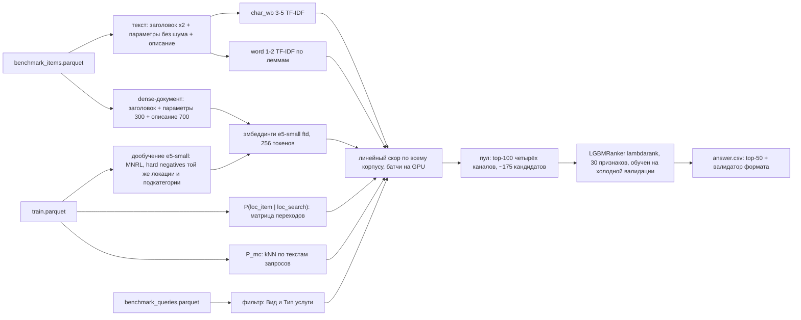

# Кандидатогенерация для поиска услуг Авито

Решение подбирает к поисковому запросу 50 объявлений из 189 тысяч так, чтобы среди них оказался исполнитель, которого человек выберет. Recall@50 на лидерборде — 0,8963.

## Как устроено решение



Каждое объявление получает оценку: насколько его текст подходит к запросу и насколько оно подходит по месту, подкатегории и фильтру. Из лучших по нескольким оценкам собирается около 175 кандидатов, и модель ранжирования выбирает из них 50.

## С какими трудностями пользователя работает решение

**Запросы короткие и неточные.** В среднем три слова, с опечатками и склейками. Человек называет задачу своими словами, а исполнитель описывает услугу своими. Текст сравнивается тремя способами:
- по кусочкам слов — это устойчиво к опечаткам;
- по леммам;
- по смыслу — моделью multilingual-e5-small, дообученной на том, какие объявления люди выбирали по каким запросам.

Объявление читается целиком, с описанием: в заголовке и параметрах часто нет слов, которыми ищут.

**Исполнитель нужен рядом.** Услугу обычно оказывают на месте, поэтому объявление из города пользователя с менее точным совпадением текста полезнее идеального совпадения в другом регионе. Решение учитывает, в каких локациях люди из этой локации поиска обычно находят исполнителей, — это посчитано по их выборам. Так работают и поиски по области, когда исполнители в областном центре: у 17% поисков в самой выбранной локации нет ни одного объявления. Оцениваются все объявления, а не только первые по тексту, чтобы исполнитель рядом не потерялся из-за формулировки.

**Один запрос — разные услуги.** Ремонт — это квартира, техника или автомобиль. По похожим прошлым запросам решение оценивает, в какие подкатегории обычно уходят люди: 86% выборов по одному запросу приходятся на одну подкатегорию.

**Человек уточнил запрос фильтром.** Если выбран вид или тип услуги, объявления с этим значением в параметрах поднимаются выше. У выбранных людьми объявлений это значение есть в параметрах в 98% случаев.

**Новые исполнители не должны теряться.** У нового объявления нет кликов и отзывов, но человеку оно может подойти лучше всех. Поэтому:
- качество оценивается на поисках, где у выбранного объявления нет истории;
- признаки популярности и отзывов в итоговую модель не входят — с ними модель училась поднимать уже раскрученных исполнителей, а не подходящих.

## Данные и признаки

- `train.parquet` — около 498 тысяч выборов: запрос, локация, фильтр и объявление, которое человек выбрал. Отсюда берётся:
  - где люди из каждой локации находят исполнителей;
  - какие подкатегории стоят за запросами;
  - пары для дообучения модели текста;
  - примеры для оценки качества.
- `benchmark_items.parquet` — 189 тысяч объявлений: заголовок, параметры и описание, локация и координаты, подкатегория, цена, скрыт ли телефон и можно ли написать исполнителю.
- `benchmark_queries.parquet` — запрос, локация и фильтр.

Модель ранжирования использует 30 признаков.
- **О кандидате:**
  - оценки по тексту и места в каждой из четырёх подборок, отставание от лучшего кандидата;
  - насколько его локация и подкатегория типичны для этого запроса, совпадение с фильтром;
  - расстояние, цена, можно ли связаться с исполнителем.
- **О запросе:** длина, есть ли фильтр, ищут по городу или по региону, встречалась ли формулировка раньше, насколько однозначна подкатегория.

Что не используется и почему:
- **категория поиска** — почти все объявления из одной категории, различать нечего;
- **доставка** — для услуг её почти не выбирают: 12 поисков из 498 тысяч;
- **популярность, отзывы, рейтинг, прошлые запросы к объявлению** — они описывают прошлый успех, а не соответствие запросу, и отодвигают новых исполнителей.

## Модели и алгоритмы

- **TF-IDF** по символьным n-граммам (3–5) и по леммам слов (pymorphy3), косинусная близость.
- **multilingual-e5-small**, дообученная как bi-encoder на парах запрос — выбранное объявление. Лосс MNRL, трудные примеры — объявления той же локации и подкатегории, чтобы модель различала близкие варианты, а не очевидно чужие.
- **Место, подкатегория и фильтр:**
  - матрица переходов между локациями по выборам пользователей;
  - kNN (k = 20) по похожим прошлым запросам — для подкатегории;
  - поиск значения фильтра в параметрах объявления.
- **Сумма оценок** с весами, подобранными Optuna, — для всех объявлений на GPU.
- **LightGBM LambdaRank** (150 деревьев) выбирает итоговые 50 из пула около 175 кандидатов.

## Как оценивалось качество

- **Прошлые поиски откладываются целиком**, как их делают люди: запрос вместе с городом и фильтром.
  - 5 000 формулировок убраны из обучения полностью — это новые запросы;
  - ещё 1 500 — знакомые формулировки в новом контексте.
  
  Всё, чему решение учится, считается только по оставшимся данным.
- **У объявлений, выбранных в отложенных поисках, стёрта история кликов** — для решения они как новые исполнители.
- **Recall@50 считается отдельно** для новых и знакомых формулировок, с фильтром и без. Затем результаты сводятся в долях реальных поисков: фильтром пользуется примерно треть.
- **Изменение остаётся, только если прирост заметно больше шума** — от 0,3 п.п. Иначе выбирается более простой вариант. Веса подбираются на одной половине отложенных поисков и проверяются на другой.
- **Формат ответа проверяется автоматически** перед каждой отправкой.

## Где решение ошибается и что с этим сделано

- **Поиск по области.** Когда человек ищет по региону, нужный исполнитель находится реже: 0,82 против 0,93 при поиске по городу. Больше всего здесь помогли переходы между локациями по выборам людей. Гео-сглаживание и отдельные настройки для регионов пока дали прирост в пределах шума. Это главное, что стоит улучшать дальше.
- **Новые формулировки без фильтра.** Почти половина поисков — формулировка, которой раньше не было, без уточнений. Для них recall ниже всего — 0,91. Опереться можно только на текст, поэтому на них направлены дообучение модели текста и чтение описания целиком.
- **Нужного исполнителя нет среди кандидатов.** У 4% поисков он не попадает в пул, и модель ранжирования его уже не поднимет. Расширение подборок до 200 кандидатов дало лишь +0,16 п.п., поэтому оставлен более простой вариант.
- **Ошибки в данных объявлений:**
  - в параметрах много служебного текста — график, тип стоимости, адрес, — он вычищен;
  - описание сначала обрезалось до 300 символов, хотя именно там исполнители пишут, что делают, — теперь читается целиком (+2,6 п.п.);
  - фильтр приходит одной строкой без разделителей — он разбирается по списку известных полей.
- **Модель училась на прошлом успехе.** Объявления, выбранные в прошлом, — те, что дожили до сегодня и уже раскручены: медиана отзывов у них 42 против 15 по всем объявлениям. Модель с признаками популярности поднимала таких исполнителей. Признаки убраны, качество оценивается на поисках без истории выбранного объявления.
- **Воспроизводимость.** Два одинаковых запуска давали немного разные ответы из-за вычислений на видеокарте, а обучение модели ранжирования останавливалось слишком рано. Теперь вычисления детерминированы, число деревьев фиксировано, ответ повторяется побайтово.

## Результаты

| версия | что изменилось | отложенные поиски | лидерборд |
|---|---|---|---|
| s3 | сумма оценок текста, места, подкатегории и фильтра | 0,8967 | 0,8801 |
| s6 | + модель ранжирования | 0,9196 | 0,8912 |
| s9 | модель ранжирования без признаков популярности и отзывов | 0,9154 | 0,8917 |
| **s10** | **+ модель текста читает описание объявления** | **0,9236** | **0,8963** |

Все шаги с цифрами — в [docs/TECHNICAL.md](docs/TECHNICAL.md).

## Проверенные гипотезы

| гипотеза | что показала проверка |
|---|---|
| искать только в локации пользователя | хуже, до −1,9 п.п.: 17% людей выбирают исполнителя из другой локации |
| приписать объявлению прошлые запросы к нему | помогает только старым объявлениям, новым мешает |
| сглаживать локации по расстоянию, отдельно настроить регионы | +0,3 п.п., в пределах шума |
| переносить запросы на похожие объявления | от −0,1 до −1,2 п.п. |
| cross-encoder — модель, читающая запрос и объявление вместе | +0,3 п.п. ценой больше часа вычислений |
| 200 кандидатов вместо 100 в каждой подборке | +0,16 п.п. |

## Запуск

Нужны Linux, Python 3.12, видеокарта NVIDIA с 8 ГБ памяти и 16 ГБ RAM. После установки всё работает без сети.

```bash
bash scripts/install.sh            # окружение (нужна сеть)
bash scripts/download_models.sh   # базовые модели (нужна сеть, один раз)
# положить dataset.zip в data/raw/
bash scripts/run_all.sh --clean    # всё с нуля, офлайн -> answer.csv
```

Прогон с нуля занимает около 2 часов, почти всё время уходит на дообучение модели текста.

Готовые модели и финальный ответ лежат на [Google Drive](https://drive.google.com/drive/folders/1SR7BWIuiPESjcB3aI-q1jusWh7qcbkTk?usp=sharing). Чтобы воспользоваться ими:
1. Распакуйте из корня проекта `avito-candgen_models_hf.tar.gz` и `avito-candgen_models_s10.tar.gz` (`tar -xzf <архив>`).
2. Запустите `bash scripts/run_all.sh` без `--clean`.

Ответ строится примерно за 5 минут и повторяется побайтово. Что лежит в каждом архиве — в [docs/TECHNICAL.md, раздел Архивы моделей](docs/TECHNICAL.md#архивы-моделей).

## Что где лежит

- [docs/TECHNICAL.md](docs/TECHNICAL.md) — подробное описание: валидация, признаки, все эксперименты с цифрами, воспроизводимость, версии компонентов.
- [EXPERIMENTS.md](EXPERIMENTS.md) — журнал экспериментов, включая неудачные.
- [reports/presentation.md](reports/presentation.md) — итоги в виде слайдов; [reports/eda.md](reports/eda.md) — разведочный анализ данных.
- `configs/default.yaml` — все параметры, `src/candgen/` — код, `scripts/` — запуск.
- [Google Drive](https://drive.google.com/drive/folders/1SR7BWIuiPESjcB3aI-q1jusWh7qcbkTk?usp=sharing) — всё большое: архивы моделей, финальный `answer.csv`, архив кода.

## Использованные компоненты

| компонент | лицензия | зачем |
|---|---|---|
| Python 3.12 | PSF | вся кодовая база |
| intfloat/multilingual-e5-small | MIT | основа модели текста (дообучается на выборах пользователей) |
| deepvk/USER-base, intfloat/multilingual-e5-base | Apache-2.0, MIT | сравнивались с e5-small, в итоговое решение не вошли |
| PyTorch, sentence-transformers, transformers, huggingface-hub | BSD-3-Clause, Apache-2.0 | модели на GPU, дообучение, оценка всего корпуса |
| scikit-learn, scipy, numpy, joblib | BSD-3-Clause | TF-IDF, разреженные матрицы, вычисления |
| pymorphy3 + словари OpenCorpora | MIT, CC BY-SA | лемматизация |
| LightGBM | MIT | модель ранжирования |
| Optuna | MIT | подбор весов |
| pandas, pyarrow | BSD-3-Clause, Apache-2.0 | данные |
| matplotlib, PyYAML, tqdm | Matplotlib License, MIT, MPL-2.0/MIT | графики, конфиги, прогресс |
| polars, duckdb, RapidFuzz, snowballstemmer, bm25s | MIT, BSD-3 | есть в зависимостях, в решении не используются |

Версии и статьи, на которых основаны идеи, — в [docs/TECHNICAL.md](docs/TECHNICAL.md).
