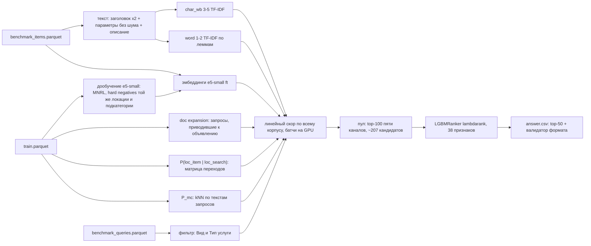

# Авито: кандидатогенерация для поиска услуг (Recall@50)

Для каждого запроса бенчмарка (`benchmark_queries.parquet`, 2 452 шт.) нужно вернуть до 50 уникальных объявлений из корпуса (`benchmark_items.parquet`, 189 212 шт.). Метрика — Recall@50: доля релевантных объявлений запроса, попавших в top-50, усреднённая по запросам. Обучающие данные — `train.parquet`, 497 673 пары «запрос → выбранное объявление».

## Результат

Recall@50 на собственной валидации (метрика `bench_adj`, см. «Валидация»):

| этап | что добавлено | bench_adj | Δ, п.п. | weighted | сабмит |
|---|---|---|---|---|---|
| 2 | baseline из ТЗ: char TF-IDF + P_loc + фильтр + P_mc | 0,8437 | — | 0,8542 | — |
| 2 | очистка параметров от шума, описание объявления целиком | 0,8731 | +2,94 | 0,8820 | — |
| 2 | + word TF-IDF по леммам, подбор весов Optuna | 0,8852 | +1,21 | 0,8906 | №1 |
| 3 | + dense (USER-base), doc expansion, подбор весов | 0,9095 | +2,43 | 0,9151 | №2 |
| 4 | dense → e5-small, дообученный на кликах train | 0,9177 | +0,82 | 0,9232 | №3 |
| 5 | LightGBM-предранкер пула кандидатов | **0,9377** | +1,99 | **0,9423** | №4 |

Итого +9,4 п.п. к baseline из ТЗ. Все эксперименты, включая неудачные, — в `EXPERIMENTS.md`. EDA — в `reports/eda.md`. Разбор результатов по запросам — `reports/demo.html`.

## Схема пайплайна



## Как это работает

### Валидация

Бенчмарк собран из запросов с конкретным контекстом поиска. Валидация повторяет эту структуру (`src/candgen/validation.py`):

- **Группа** — строки train с одинаковым полным контекстом: нормализованный текст, локация, фильтр, доставка, категория. Это аналог одного `query_id`. Релевантные — выбранные в группе объявления, которые есть в корпусе (у 97% групп такое объявление ровно одно).
- **unseen-срез** (5 000 текстов): для текста случайно выбирается одна группа, а **все** строки этого текста удаляются из train.
- **seen-срез** (1 500 текстов): откладывается одна группа, остальные группы текста остаются.
- **Приоры, память и expansion на валидации считаются только по остатку train.** Дообученная модель для валидации тоже учится только на остатке.
- **Метрика решений `bench_adj`** — recall@50 по 4 ячейкам (seen/unseen × фильтр есть/нет) с весами, вычисленными из `benchmark_queries` (0,210 / 0,164 / 0,159 / 0,466). Фильтр есть у 67% строк train, но только у 37% запросов бенчмарка; без перевзвешивания бонус за фильтр переоценивается.
- **Честность подбора весов.** Веса подбираются на половине A валидации, прирост проверяется на отложенной половине B. Дополнительно считается recall по объявлениям, встречавшимся и не встречавшимся в train: история train помогает только первым.

### Источники кандидатов

- **Текст объявления** (для лексики): заголовок ×2 + параметры[:400] без служебного шума (график работы, тип стоимости, адрес) + описание целиком. Затем нормализация: нижний регистр, ё→е, только буквы и цифры. Описание целиком вместо первых 300 символов дало +2,6 п.п.
- **char_wb 3–5 TF-IDF** устойчив к опечаткам и склейкам. **word 1–2 TF-IDF** строится по леммам pymorphy3, с кэшем лемм по уникальным словам. Оба источника сделаны на HashingVectorizer: векторизация параллельная, без словаря в памяти, IDF — по корпусу.
- **Dense — multilingual-e5-small, дообученный на кликах train** (`src/candgen/finetune.py`): 445 тыс. пар «запрос → объявление». Hard negative для пары — другое объявление той же локации и подкатегории. Лосс MNRL, batch 128, 1 эпоха, bf16. Без приоров модель даёт recall@50 0,360 — против 0,277 у готового USER-base и 0,319 у char TF-IDF.
- **Doc expansion:** объявлению, которое выбирали в train, приписан текст приводивших к нему запросов (до 30 самых частых) — отдельный char TF-IDF источник.

### Приоры

- **P(loc_item | loc_search)** — матрица переходов по кликам train. В 17% запросов бенчмарка у локации поиска нет объявлений в корпусе: это регионы-агрегаты, например «область → областной центр». Поэтому сравнивать локации на равенство нельзя. Вклад в скор: `0.067·log(P + 3e-6)`.
- **P_mc** — распределение подкатегорий по 20 ближайшим текстам запросов train (char 2–4 TF-IDF, kNN на GPU). 86% кликов запроса приходятся на его главную подкатегорию.
- **Фильтр:** по 0,5 за «Вид услуги» и «Тип услуги», если пара «ключ значение» есть в параметрах объявления. У выбранных объявлений она есть в 98% случаев. Значение фильтра обрывается на любом известном ключе (список ключей — в конфиге).

### Скоринг всего корпуса

```
score(q, d) = cos_char + 0.61·cos_word + 0.5·cos_e5ft + 0.39·cos_expansion
            + 0.067·log(P_loc + 3e-6) + 0.012·log(P_mc + 8.6e-4) + 0.31·bonus_filter
```

Скорится **весь корпус**, а не top-N текстового поиска: объявление может быть 2 000-м по тексту, но единственным в городе запроса. Батч из 512 запросов умножается на корпус на GPU — разреженная TF-IDF матрица корпуса (только признаки, встречающиеся в запросах) и плотные эмбеддинги. К результату прибавляются приоры, затем `torch.topk`. В памяти в каждый момент только B × N скоров. Веса и eps подобраны Optuna (TPE, seed 42).

### Предранкер

`src/candgen/prerank.py`:

- **Пул** — объединение top-100 пяти каналов: итоговый линейный скор и «char / word / dense / expansion + приоры». В среднем 207 кандидатов на запрос; релевантное попадает в пул у 96,7% запросов.
- **38 признаков:** сырые значения источников и ранги в каналах, P_loc и P_mc, совпадение «Вид» и «Тип» услуги по отдельности, расстояние, свойства объявления (рейтинг, отзывы, цена, длины текстов, флаги, популярность в кликах на миллион строк train), свойства запроса (длина, фильтр, регион, встречался ли в train, острота P_mc).
- **Модель** — `LGBMRanker` (lambdarank, группа — запрос).
- **Обучение — cross-fitting на val-запросах, 2 фолда.** Только у них все признаки честные: у запросов остатка train клики уже «вшиты» в expansion, P_mc и дообученный e5. Для сабмита ранкер учится на всех val-запросах.
- **Результат:** recall@50 0,9177 → **0,9377**, в том числе на новых объявлениях 0,904 → 0,925.

### Оригинальные фишки (этап 4)

Правило: одна фишка — один эксперимент; в сабмит идёт только прирост ≥ +0,5 п.п. bench_adj.

| фишка | идея | результат |
|---|---|---|
| 7. Дообучение e5-small с hard negatives по локации | контрастивное обучение на кликах; негатив — объявление той же локации и подкатегории | **+0,82 п.п.**, на новых объявлениях +1,4 — **в итоге** |
| 2. Иерархия локаций из данных | P_loc сглаживается гео-ядром: координаты локации = медиана координат её объявлений, K ∝ n_items·exp(−км/σ) | +0,29 (< 0,5) — не вошло |
| 6. «Регион против города» | тип локации определяется по доле кликов в неё саму (бимодально: у городов > 0,6, у регионов ≈ 0); отдельные веса для регионов | вместе с фишкой 2: +0,29 на отложенной половине — не вошло |
| 4. Перенос запросов на похожие объявления | запросы объявлений train переносятся на ближайшие по dense объявления корпуса той же подкатегории | −0,07…−1,2 — не вошло |
| 9. Демо-страница | `reports/demo.html`: запрос → 50 кандидатов с разложением скора по источникам | `python -m candgen.demo` |

## Валидация и лидерборд

| сабмит | тёплая валидация | холодная валидация | лидерборд |
|---|---|---|---|
| s3: линейное слияние (этап 4) | 0,9177 | 0,8967 | 0,8801 |
| s6: предранкер, обучен на тёплой валидации | 0,938 | 0,9196 | 0,8912 |

Валидация завышает результат, и у ранкера — сильнее. Причина в том, что val-релевантные — это объявления, которые кликали в train:

1. **У 40% из них есть история в остатке train:** doc expansion, популярность, пары при дообучении e5. В тесте релевантные в основном новые. Поэтому добавлен вариант **`ctx_cold`**: из остатка удалены все строки с релевантными объявлениями валидации (1,3% строк), и история у них полностью отсутствует. Холодная валидация ближе к лидерборду: для линейного слияния разрыв −1,7 п.п., а не −3,8. Doc expansion на ней вредит.
2. **Смещение «выживших» объявлений.** Val-релевантные — объявления, которые кликали в период train и которые до сих пор активны. У них в 3 раза больше отзывов, чем у типичного объявления корпуса (медиана 42 против 15). Ранкер с признаками «качества» выучил это и тянет в выдачу раскрученные объявления. Поэтому у ранкера разрыв с лидербордом на 1,2 п.п. больше, чем у линейного слияния.

Отсюда «чистые» ранкеры: они обучены на холодной валидации, без expansion и без признаков истории объявления (s8), а s9 — ещё и без признаков «качества» (`scripts/make_clean_rankers.sh`). Калибровка режимом `python -m candgen.prerank --mode transfer` — ранкер учится на одном варианте валидации и оценивается на другом.

## Что не сработало

- **Маска по локации** (вариант (b) из ТЗ: поиск внутри «своих» локаций) не лучше полного перебора, а чем строже порог, тем хуже: до −1,9 п.п.
- **word TF-IDF и источник «только заголовок»** при старых весах приоров только мешают: текст перевешивает приоры. word помогает лишь при совместном подборе весов (+0,74). Заголовок и после подбора даёт +0,12 и выключен.
- **Длина параметров** больше 400 символов, заголовок ×3, настройки kNN подкатегорий (k, степень веса) — в пределах шума.
- **«Память»** (объявления, выбранные по тому же тексту в train) — +0,01. Её сигнал уже содержится в P_mc: kNN находит сам текст запроса.
- **e5-base поверх USER-base** — +0,12. RRF и квоты вместо линейной суммы — хуже на 0,1–2 п.п.
- **Фишки 2, 4, 6** — см. таблицу выше. Регионы-агрегаты остаются самым слабым местом: recall 0,84 против 0,94 у городов, это 17% бенчмарка. На ~500 региональных запросах в половине валидации подбор отдельных весов неотличим от подгонки.
- **Переподбор весов после замены dense-модели** — −0,08 на отложенной половине; веса оставлены прежними.
- **Риск doc expansion.** На валидации +1,75 п.п., но recall новых объявлений без expansion чуть выше (0,899 против 0,890). Выигрыш на тесте зависит от доли релевантных объявлений, которые встречались в train; эта доля неизвестна.

## Как воспроизвести

Чистый Linux, Python 3.12, NVIDIA GPU от 8 ГБ, RAM от 16 ГБ.

```bash
bash scripts/install.sh           # .venv + пинованные зависимости (сеть)
bash scripts/download_models.sh   # модели HuggingFace в models/hf (сеть, один раз)
# data/raw/dataset.zip должен лежать в data/raw (или DATASET_ZIP=/путь/к/zip)
bash scripts/run_all.sh --clean   # всё с нуля офлайн -> answer.csv
```

Время полного прогона на RTX 3060 Ti 8 ГБ, Ryzen 7 5800X, 22 ГБ RAM: **58 мин 33 с**.

| шаг | время |
|---|---|
| данные | 2 с |
| срезы валидации | 8 с |
| дообучение e5-small на остатке train (для признаков ранкера) | 21 мин |
| дообучение e5-small на всём train (для сабмита) | 29 мин |
| индексы, эмбеддинги, приоры, ранкер, `answer.csv` | 8 мин |

Если модели и кэши уже есть, `bash scripts/run_all.sh` без `--clean` строит ответ за ~8 минут. Пик памяти — ~12 ГБ RAM и ~5 ГБ видеопамяти. Все запуски идут с `HF_HUB_OFFLINE=1`; сеть нужна только двум первым командам.

**Воспроизводимость.** Дообучение на GPU не бит-в-бит детерминировано. Повторный прогон с нуля дал на валидации 0,9380 против 0,9377, а его ответ совпадает с сабмитом №4 на 94%; расхождения — в хвостах списков.

Отдельные шаги (из корня, после `source scripts/env.sh`):

```bash
python -m candgen.eda                        # reports/eda.md + reports/fig/*.png
python -m candgen.validation --build         # срезы валидации -> artifacts/val_*
python -m candgen.validation --selftest      # проверка метрики и детерминизма срезов
python -m candgen.finetune --mode val|full   # дообучение e5-small (остаток / весь train)
python -m candgen.pipeline                   # recall@50 линейного слияния на валидации
python -m candgen.pipeline --ablation <набор> # наборы запусков — experiments.* в конфиге
python -m candgen.tune                       # подбор весов Optuna (половина A -> проверка на B)
python -m candgen.prerank                    # предранкер: cross-fitting на валидации
python -m candgen.prerank --mode bench       # предранкер -> answer.csv (так делает run_all.sh)
python -m candgen.submit                     # линейное слияние -> answer.csv (сабмит №3)
python -m candgen.submit --validate answer.csv  # только проверка формата
python -m candgen.demo                       # reports/demo.html
```

Все гиперпараметры — в `configs/default.yaml`. Разовую правку можно передать ключом `--set a.b=значение`, например `--set fusion.weights.expansion=0`. Скрипты `scripts/experiments_stage2*.sh` воспроизводят серии этапа 2 с конфигом того времени (см. историю git).

Разработка велась из Windows: Claude Code и VS Code — в Windows, вычисления — в WSL2 Ubuntu через мост `w.cmd` (см. `CLAUDE.md`). Для запуска на Linux мост не нужен.

## Структура

```
configs/default.yaml     все пути, гиперпараметры и наборы экспериментов
scripts/                 install, download_models, setup_data, run_all, check_env, bg, env, experiments_*
src/candgen/
  io.py                  загрузка parquet (id — строки), проверка данных
  text.py                нормализация, разбор фильтров, тексты документов, леммы
  validation.py          срезы seen/unseen, bench_adj, selftest
  eda.py                 EDA -> reports/eda.md
  priors.py              P_loc (+ гео-сглаживание), P_mc (kNN), бонус фильтра
  retrievers/            lexical (TF-IDF), dense (sentence-transformers), memory (память, expansion)
  fusion.py              линейный скоринг всего корпуса на GPU, RRF, квоты
  pipeline.py            сборка компонентов, CLI абляции
  tune.py                подбор весов Optuna
  finetune.py            дообучение e5-small
  prerank.py             LightGBM-предранкер
  submit.py              answer.csv и его валидатор
  demo.py                демо-страница
reports/                 eda.md, fig/, demo.html, tune_*.json
artifacts/, models/, logs/  кэши, модели и логи (не в git)
```

## Использованные компоненты

| компонент | версия | лицензия | где используется |
|---|---|---|---|
| Python | 3.12.3 | PSF | вся кодовая база |
| pandas | 3.0.6 | BSD-3-Clause | таблицы, агрегаты |
| pyarrow | 25.0.1 | Apache-2.0 | чтение parquet, векторный поиск подстрок |
| numpy | 2.5.3 | BSD-3-Clause | численные операции |
| scipy | 1.18.1 | BSD-3-Clause | разреженные TF-IDF матрицы |
| scikit-learn | 1.9.1 | BSD-3-Clause | HashingVectorizer, TfidfVectorizer (kNN подкатегорий), нормализация |
| joblib | зависимость sklearn | BSD-3-Clause | параллельная векторизация, сохранение моделей |
| PyTorch | 2.11.0+cu128 | BSD-3-Clause | скоринг корпуса на GPU (sparse CSR × dense), kNN, дообучение |
| sentence-transformers | 6.1.0 | Apache-2.0 | загрузка и кодирование dense-моделей |
| transformers | 5.17.0 | Apache-2.0 | зависимость sentence-transformers, прямой проход при дообучении |
| huggingface-hub | зависимость | Apache-2.0 | разовое скачивание моделей |
| intfloat/multilingual-e5-small | snapshot 614241f6 | MIT | **база для дообучения — в итоговом решении** |
| deepvk/USER-base | snapshot e8446472 | Apache-2.0 | dense на этапе 3 (сабмит №2); в итоговом решении заменён |
| intfloat/multilingual-e5-base | snapshot d1287505 | MIT | эксперименты этапа 3; в итоговом решении не используется |
| pymorphy3 + pymorphy3-dicts-ru | 2.0.6 | MIT; словари OpenCorpora — CC BY-SA | лемматизация для word-источника |
| LightGBM | 4.7.0 | MIT | предранкер (LGBMRanker, lambdarank) |
| Optuna | 5.0.0 | MIT | подбор весов слияния (TPE) |
| matplotlib | 3.11.2 | Matplotlib License (BSD-совместимая) | графики EDA |
| PyYAML | 6.0.3 | MIT | конфиги |
| tqdm | 4.70.1 | MPL-2.0 / MIT | зависимость |
| polars, duckdb, RapidFuzz, snowballstemmer, bm25s | см. requirements.txt | MIT / MIT / MIT / BSD-3 / MIT | установлены по ТЗ, в итоговом решении не используются |

Идеи из статей:

| идея | источник | где |
|---|---|---|
| E5 и префиксы «query: » / «passage: » | Wang et al., Text Embeddings by Weakly-Supervised Contrastive Pre-training, arXiv:2212.03533; Multilingual E5, arXiv:2402.05672 | dense, дообучение |
| MNRL (in-batch negatives) и hard negatives | Henderson et al., Efficient Natural Language Response Suggestion, arXiv:1705.00652; Karpukhin et al., DPR, arXiv:2004.04906 | `finetune.py` |
| Doc expansion запросами | Nogueira et al., Document Expansion by Query Prediction, arXiv:1904.08375; у нас вместо генерации — реальные запросы из логов | `retrievers/memory.py` |
| Reciprocal Rank Fusion | Cormack et al., SIGIR 2009 | `fusion.py` (сравнение) |
| LambdaRank / LambdaMART | Burges, From RankNet to LambdaRank to LambdaMART, MSR-TR-2010-82 | `prerank.py` |
| TPE | Bergstra et al., Algorithms for Hyper-Parameter Optimization, NeurIPS 2011 | `tune.py` |
