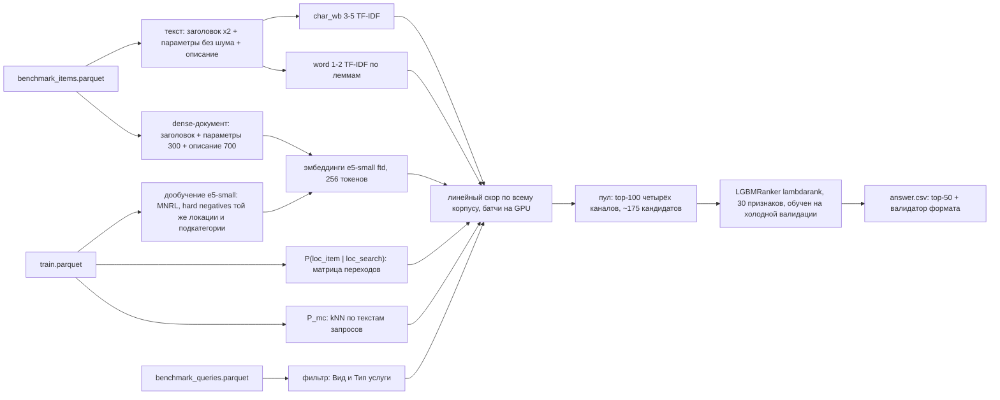

# Кандидатогенерация для поиска услуг Авито

Человек ищет услугу — «ремонт холодильника», «репетитор по математике» — в своём городе, иногда с фильтром по виду услуги. Для каждого из 2 452 таких запросов нужно отобрать из 189 тысяч объявлений 50 кандидатов так, чтобы среди них оказались объявления, которые человек действительно выбрал. Качество измеряется метрикой Recall@50 — долей нужных объявлений, попавших в эти 50.

**Результат на лидерборде: Recall@50 = 0,8963.** Решение работает офлайн на одной видеокарте 8 ГБ и воспроизводится одной командой.

## Как устроено решение



Каждое объявление корпуса получает оценку, в которой сложены похожесть текста и то, насколько вероятны для этого запроса локация, подкатегория и значение фильтра. Из лучших по нескольким таким оценкам собирается пул примерно из 175 кандидатов, и обученная модель выбирает из него итоговые 50.

## Основные идеи

### 1. Сначала — валидация, которой можно верить

Разметки теста нет, а число попыток на лидерборде ограничено. Поэтому сначала строится локальная проверка, устроенная как тест. Из train откладываются поиски с полным контекстом (текст, город, фильтр) — так же, как устроен тестовый запрос. Часть отложенных текстов модель раньше не видела, часть — видела в других контекстах.

Итоговая метрика взвешивает эти группы в той же пропорции, что и в тесте. Это важно: фильтр есть у двух третей поисков в train, но лишь у трети тестовых запросов, и без перевзвешивания легко переоценить всё, что связано с фильтром.

### 2. Оценивать весь корпус, а не первые результаты текстового поиска

Нужное объявление может быть двухтысячным по тексту, но единственным в городе пользователя. Поэтому оценку получает каждое из 189 тысяч объявлений. Запросы обрабатываются пачками на видеокарте, и в памяти хранятся только лучшие кандидаты.

### 3. Локация — это переходы, а не совпадение

У 17% тестовых запросов в выбранной локации нет ни одного объявления: человек ищет «по области», а исполнители находятся в областном центре. Поэтому вместо проверки «тот же город или нет» используется вероятность перейти из локации поиска в локацию объявления, посчитанная по кликам.

### 4. Подкатегория и фильтр

По 20 самым похожим прошлым запросам решение определяет, в какие подкатегории обычно уходят клики: 86% кликов одного запроса приходятся на одну подкатегорию. Если в поиске выбран фильтр «Вид/Тип услуги», объявления с этим значением в параметрах получают бонус.

### 5. Текст: точные совпадения и смысл

Два способа сравнивать текст дополняют друг друга:
- **сравнение по кусочкам слов и леммам** устойчиво к опечаткам и склейкам;
- **нейросетевая модель multilingual-e5-small, дообученная на кликах из train**, улавливает смысл: связывает «сантехника» с «заменой смесителя».

При дообучении модели специально показывались «трудные» неправильные ответы — объявления из того же города и той же подкатегории. Так она учится различать именно близкие варианты. Ещё один заметный прирост дало то, что модель читает описание объявления, а не только заголовок и параметры.

### 6. Ранкер поверх пула

Пул составляется из лучших кандидатов по четырём оценкам. Нужное объявление попадает в него у 96% запросов. Модель LightGBM переставляет пул по 30 признакам — оценкам и позициям кандидата в каждой из четырёх оценок, вероятностям локации и подкатегории, расстоянию, цене — и отдаёт первые 50.

### 7. Урок лидерборда: не учиться на прошлом успехе

Первый ранкер показал 0,938 на валидации и только 0,891 на лидерборде. У разрыва нашлись две причины:
- **У отложенных для проверки объявлений есть прошлое.** Их уже кликали, и многие из них хорошо знакомы модели по истории. А в тесте, судя по результатам, нужные объявления в основном новые.
- **Активные до сих пор объявления раскручены:** медиана отзывов у них 42 против 15 по корпусу. Ранкер научился тянуть наверх популярное.

Решение:
- **«Холодная» валидация:** у проверочных объявлений стёрта вся история.
- **Ранкер без признаков популярности и отзывов.**

После этого прирост на валидации стал предсказуемо переноситься на лидерборд — примерно наполовину. Дальнейшие улучшения выбирались по холодной валидации, без загрузок вслепую.

## Результаты

| версия | что изменилось | холодная валидация | лидерборд |
|---|---|---|---|
| s3 | сумма оценок, без ранкера | 0,8967 | 0,8801 |
| s6 | + ранкер | 0,9196 | 0,8912 |
| s9 | ранкер обучен на холодной валидации, без признаков популярности и отзывов | 0,9154 | 0,8917 |
| **s10** | **+ модель читает описание объявления** | **0,9236** | **0,8963** |

От простой версии (сравнение текста + вероятности локации и подкатегории + фильтр) до первого ранкера результат на исходной валидации вырос с 0,844 до 0,938. Все шаги с цифрами — в [docs/TECHNICAL.md](docs/TECHNICAL.md).

## Проверенные гипотезы

Изменение входило в решение, только если давало прирост заметно больше шума валидации. Не вошли:

| гипотеза | что показала проверка |
|---|---|
| искать только внутри «своих» локаций | хуже полного перебора, до −1,9 п.п. |
| приписать объявлению тексты запросов, по которым его находили раньше | на холодной валидации вредит: у новых объявлений такой истории нет |
| сглаживать локации по расстоянию, отдельно настроить регионы | +0,3 п.п. — в пределах шума |
| переносить запросы на похожие объявления | от −0,1 до −1,2 п.п. |
| отдельная модель, оценивающая пару «запрос — объявление» целиком (cross-encoder) | +0,3 п.п. ценой больше часа вычислений |
| брать в пул 200 кандидатов вместо 100 | +0,16 п.п. — в пределах шума |

## Запуск

Нужны Linux, Python 3.12, видеокарта NVIDIA от 8 ГБ и 16 ГБ RAM.

```bash
bash scripts/install.sh            # окружение (нужна сеть)
bash scripts/download_models.sh   # базовые модели (нужна сеть, один раз)
# положить dataset.zip в data/raw/
bash scripts/run_all.sh --clean    # всё с нуля, офлайн -> answer.csv
```

Прогон с нуля занимает около 2 часов, почти всё время уходит на дообучение нейросетевой модели. С готовыми моделями из архивов (см. [docs/TECHNICAL.md](docs/TECHNICAL.md), раздел «Архивы моделей») ответ строится примерно за 5 минут и повторяется побайтово.

## Что где лежит

- [docs/TECHNICAL.md](docs/TECHNICAL.md) — подробное описание: валидация, признаки, все эксперименты с цифрами, воспроизводимость, версии компонентов.
- [EXPERIMENTS.md](EXPERIMENTS.md) — журнал экспериментов, включая неудачные.
- [reports/presentation.md](reports/presentation.md) — итоги в виде слайдов; [reports/eda.md](reports/eda.md) — разведочный анализ данных.
- `configs/default.yaml` — все параметры, `src/candgen/` — код, `scripts/` — запуск.

## Использованные компоненты

| компонент | лицензия | зачем |
|---|---|---|
| Python 3.12 | PSF | вся кодовая база |
| intfloat/multilingual-e5-small | MIT | основа нейросетевой модели текста (дообучается на кликах) |
| deepvk/USER-base, intfloat/multilingual-e5-base | Apache-2.0, MIT | сравнивались с e5-small, в итоговое решение не вошли |
| PyTorch, sentence-transformers, transformers, huggingface-hub | BSD-3-Clause, Apache-2.0 | модели на GPU, дообучение, оценка всего корпуса |
| scikit-learn, scipy, numpy, joblib | BSD-3-Clause | TF-IDF, разреженные матрицы, вычисления |
| pymorphy3 + словари OpenCorpora | MIT, CC BY-SA | лемматизация |
| LightGBM | MIT | ранкер |
| Optuna | MIT | подбор весов |
| pandas, pyarrow | BSD-3-Clause, Apache-2.0 | данные |
| matplotlib, PyYAML, tqdm | Matplotlib License, MIT, MPL-2.0/MIT | графики, конфиги, прогресс |
| polars, duckdb, RapidFuzz, snowballstemmer, bm25s | MIT, BSD-3 | есть в зависимостях, в решении не используются |

Версии и статьи, на которых основаны идеи, — в [docs/TECHNICAL.md](docs/TECHNICAL.md).
