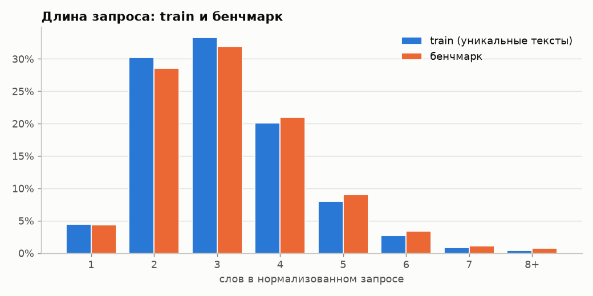
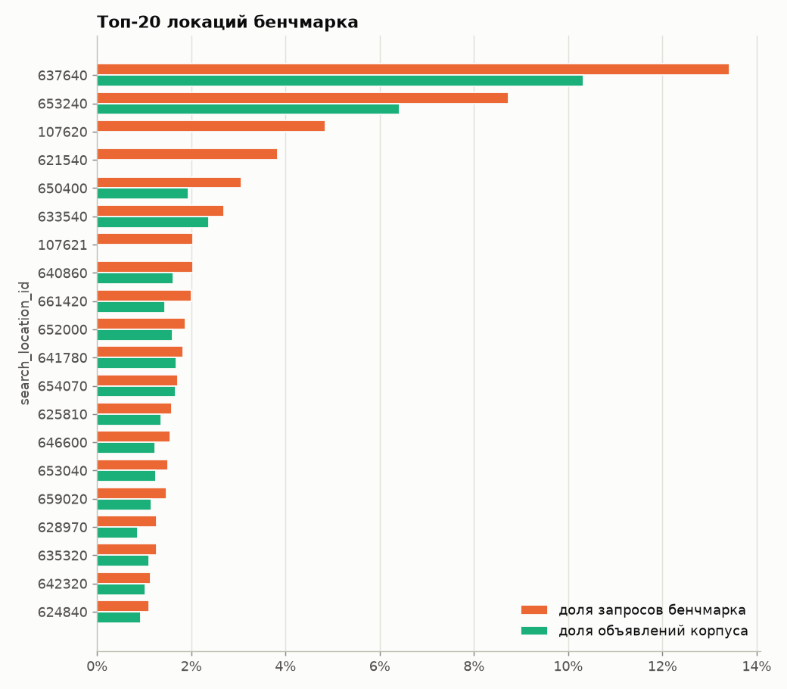
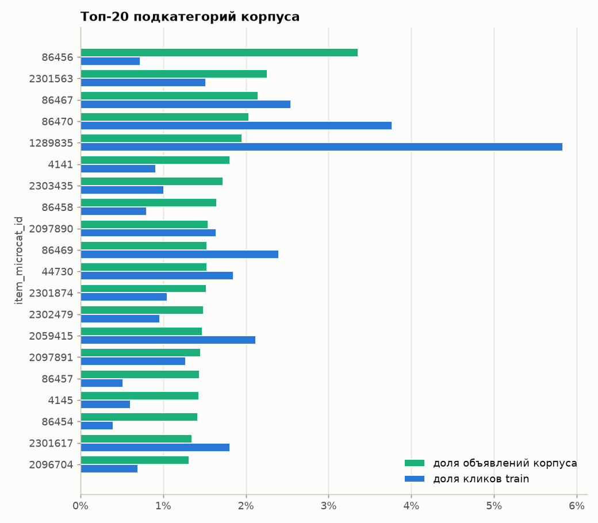
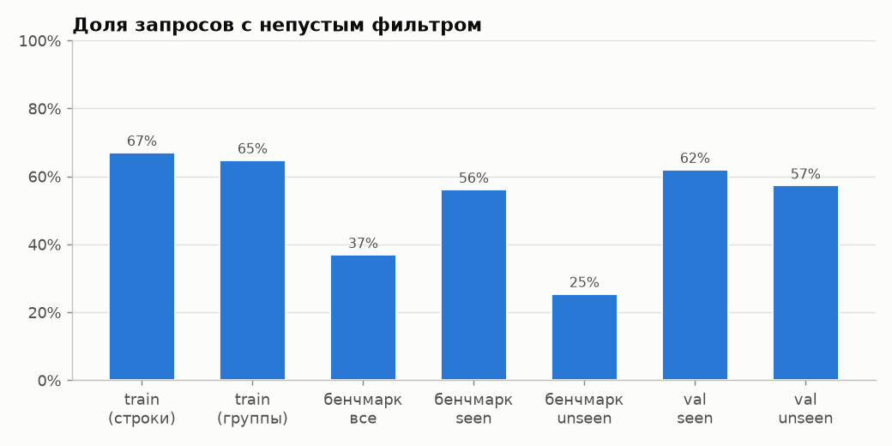
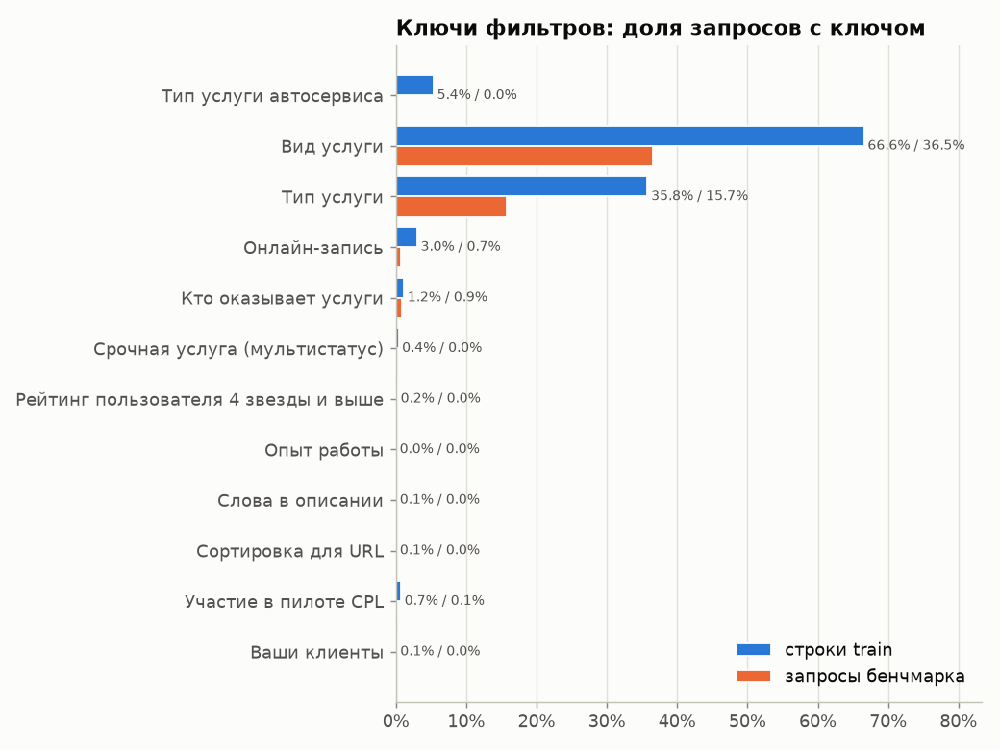

# EDA — кандидатогенерация Авито

Сгенерировано `python -m candgen.eda` 2026-09-27. Все числа пересчитываются из `data/raw` при каждом запуске.

## 1. Исходные факты о данных: перепроверка

✓ — совпало в пределах допуска; ≠ — расхождение (см. комментарий).

| № | факт | ожидалось | получено | | комментарий |
|---|---|---|---|---|---|
| 1 | Уникальных текстов запросов в train | 74,529 | 74,529 | ✓ | нормализованных: 73,706 |
| 2 | Групп (запрос, локация) в train | 307,552 | 307,552 | ✓ | норм. текст: 307,202; полный контекст: 354,241 |
| 3 | Запросов бенчмарка, дословно встречавшихся в train | 907 | 907 | ✓ | после нормализации: 919 |
| 4 | …из них с выбранными в train объявлениями корпуса | 360 | 360 | ✓ | с той же локацией: 91 (ожидалось: 91) |
| 5 | Объявлений корпуса, встречающихся в train | 18,142 | 18,142 | ✓ |  |
| 6 | Доля item_category_id = 114 в корпусе | 0.990 | 0.990 | ✓ | подкатегорий в корпусе: 752 (ожидалось: 752) |
| 7 | Доля search_category = 0 в бенчмарке | 0.090 | 0.091 | ✓ | в train таких строк всего 34 |
| 8 | Совпадение локации поиска и объявления (строки train) | 0.830 | 0.831 | ✓ |  |
| 9 | Запросы бенчмарка с локацией, которой нет среди локаций корпуса | 0.170 | 0.174 | ✓ | среди различных локаций бенчмарка: 0.212 |
| 10 | Совпадение «Вид услуги» фильтра с параметрами объявления | 0.985 | 0.984 | ✓ | пара «ключ значение»: 0.984 |
| 11 | Совпадение «Тип услуги» фильтра с параметрами объявления | 0.965 | 0.977 | ≠ | пара «ключ значение»: 0.976 |
| 12 | Доля с непустым фильтром: строки train | 0.670 | 0.670 | ✓ | уникальные группы-контексты: 0.648 |
| 13 | Доля с непустым фильтром: бенчмарк | 0.370 | 0.369 | ✓ |  |
| 14 | Доля кликов запроса в его главной подкатегории | 0.850 | 0.863 | ≠ | micro по кликам; среднее по запросам (macro): 0.931 |
| 15 | Длина запроса, слов (уникальные тексты train) | 3.20 | 3.11 | ✓ | бенчмарк: 3.20; по строкам train: 2.34 |
| 16 | Длина описания объявления корпуса, символов (среднее) | 1,400 | 1,405 | ✓ | медиана 1,054 |
| 17 | Длина параметров объявления корпуса, символов (среднее) | 970 | 974 | ✓ | медиана 738; заголовок: 34 |

Расхождений: **2** из 17.

## 2. Проверки, влияющие на валидацию и приоры

- **Уникальность текстов в бенчмарке:** из 2452 запросов дословно каждый текст встречается один раз (после нормализации совпадений: 1 — пренебрежимо), поэтому на валидации берётся одна группа на текст.
- **Доля seen в бенчмарке:** по нормализованному тексту 0.375, дословно 0.370 (разница 0.5 п.п.; меньше 1 п.п., используем нормализованную).
- **Веса ячеек бенчмарка** (вычислены из `benchmark_queries`; основа метрики `bench_adj`):

  | ячейка | вес | ожидалось |
  |---|---|---|
  | seen_filter | 0.210 | 0.209 |
  | seen_nofilter | 0.164 | 0.161 |
  | unseen_filter | 0.159 | 0.161 |
  | unseen_nofilter | 0.466 | 0.469 |

  Фильтр есть у 56.1% seen и 25.4% unseen запросов бенчмарка (36.9% в целом).
- **«Память»:** у 39.8% seen-запросов бенчмарка в train есть выбранные объявления из корпуса; на seen-срезе валидации — 37.6%.
- **Несколько контекстов у одной пары (запрос, локация):** 11.5% пар, на них 36.1% строк train. Поэтому ключ «полный контекст» и ключ «(запрос, локация)» различаются, и контрольный вариант `ql` нужен.
- **Выбранных объявлений на группу** (запрос, локация) — все объявления: 1.47 (ожидалось: 1,47). Только объявления корпуса: полный контекст — 1.114 (ровно одно у 92.8% групп), (запрос, локация) — 1.171 (ровно одно у 90.4%). Recall запроса почти всегда 0 или 1.
- **Доставка:** `search_is_delivery_search = 1` всего в 12 строках train и ни в одном запросе бенчмарка — признак неинформативен.
- **Категория 0:** у 9.1% запросов бенчмарка, а в train строк с ней всего 34: такие запросы в train почти не представлены, по категории не фильтруем.
- **Покрытие локаций бенчмарка:** 100.0% запросов имеют локацию, встречавшуюся как локация поиска в train (есть строка матрицы переходов); у 17.4% локации нет среди локаций объявлений корпуса.
- **Цена валидации:** unseen-тексты (5000 из 12169 подходящих) занимают 29.9% строк train. Приоры на валидации считаются по оставшимся строкам, поэтому оценка слегка пессимистична.

## 3. Графики

### 3.1 Длина запроса

Средняя длина: 3.11 слова у уникальных текстов train, 3.20 у бенчмарка. Запросы из 1–2 слов: 34.7% train и 32.9% бенчмарка. **Вывод:** распределения близки, запросы короткие. Текстового сигнала мало, поэтому решают приоры (локация, подкатегория) и символьные n-граммы, устойчивые к опечаткам и склейкам.

### 3.2 Топ локаций бенчмарка и корпуса

Топ-20 локаций дают 59.0% запросов бенчмарка и 38.0% объявлений корпуса. Корреляция долей локаций (запросы и корпус) r = 0.93. **Вывод:** корпус в целом следует географии запросов, но у 17.4% запросов своей локации в корпусе нет. В самом топе без объявлений корпуса остаются локации 107620, 621540, 107621 (вместе 10.7% запросов бенчмарка) — похоже на агрегаты (регион или страна), это проверим по матрице переходов на этапе 2. Нужна матрица переходов loc_search → loc_item, а не проверка равенства.

Таблица: топ локаций бенчмарка

| search_location_id | доля запросов бенчмарка | доля объявлений корпуса |
|---|---|---|
| 637640 | 13.42% | 10.33% |
| 653240 | 8.73% | 6.42% |
| 107620 | 4.85% | 0.00% |
| 621540 | 3.83% | 0.00% |
| 650400 | 3.06% | 1.93% |
| 633540 | 2.69% | 2.38% |
| 107621 | 2.04% | 0.00% |
| 640860 | 2.04% | 1.62% |
| 661420 | 2.00% | 1.44% |
| 652000 | 1.88% | 1.60% |
| 641780 | 1.84% | 1.68% |
| 654070 | 1.71% | 1.67% |
| 625810 | 1.59% | 1.36% |
| 646600 | 1.55% | 1.23% |
| 653040 | 1.51% | 1.25% |
| 659020 | 1.47% | 1.16% |
| 628970 | 1.26% | 0.87% |
| 635320 | 1.26% | 1.10% |
| 642320 | 1.14% | 1.02% |
| 624840 | 1.10% | 0.94% |

### 3.3 Подкатегории

Топ-20 подкатегорий — 34.4% корпуса и 32.4% кликов train; корреляция долей r = 0.79. Подкатегорий в корпусе: 752, при этом 86.3% кликов запроса приходятся на его главную подкатегорию. **Вывод:** prior подкатегории по похожим запросам train (P_mc) должен сильно сужать поиск.

Таблица: топ подкатегорий корпуса

| item_microcat_id | доля объявлений корпуса | доля кликов train |
|---|---|---|
| 86456 | 3.36% | 0.72% |
| 2301563 | 2.26% | 1.51% |
| 86467 | 2.15% | 2.55% |
| 86470 | 2.04% | 3.77% |
| 1289835 | 1.95% | 5.83% |
| 4141 | 1.81% | 0.91% |
| 2303435 | 1.73% | 1.01% |
| 86458 | 1.64% | 0.80% |
| 2097890 | 1.55% | 1.64% |
| 86469 | 1.53% | 2.40% |
| 44730 | 1.53% | 1.85% |
| 2301874 | 1.52% | 1.05% |
| 2302479 | 1.49% | 0.96% |
| 2059415 | 1.47% | 2.12% |
| 2097891 | 1.46% | 1.27% |
| 86457 | 1.44% | 0.51% |
| 4145 | 1.43% | 0.60% |
| 86454 | 1.42% | 0.40% |
| 2301617 | 1.35% | 1.81% |
| 2096704 | 1.32% | 0.70% |

### 3.4 Доля запросов с фильтром

В train фильтр есть у 67.0% строк, в бенчмарке — у 36.9% запросов (seen 56.1%, unseen 25.4%). **Вывод:** сдвиг большой. Валидационные срезы наследуют долю фильтра из train, поэтому решения принимаются по `bench_adj`, который перевзвешивает 4 ячейки под бенчмарк.

### 3.5 Ключи фильтров

«Вид услуги» есть у 66.6% строк train и 36.5% запросов бенчмарка, «Тип услуги» — у 35.8% / 15.7%. Остальные ключи редки. У 2.2% непустых фильтров train и 2.0% бенчмарка перед первым известным ключом стоит нераспознанный текст (редкие ключи вроде «Аренда авто …»). **Вывод:** основной сигнал — «Вид/Тип услуги»; их значения почти всегда дословно есть в параметрах выбранного объявления (см. факты 10–11), поэтому это сильный мягкий бонус.

## 4. Фильтры: разбор и совпадение с параметрами объявления

Строка фильтра — склеенные пары «ключ значение» без разделителей. Значение ключа заканчивается на следующем известном ключе (список — `configs/default.yaml: filters.keys`) или в конце строки.

| ключ | доля строк train | доля запросов бенчмарка |
|---|---|---|
| Тип услуги автосервиса | 5.37% | 0.00% |
| Вид услуги | 66.59% | 36.50% |
| Тип услуги | 35.78% | 15.74% |
| Онлайн-запись | 3.03% | 0.73% |
| Кто оказывает услуги | 1.16% | 0.90% |
| Срочная услуга (мультистатус) | 0.38% | 0.04% |
| Рейтинг пользователя 4 звезды и выше | 0.17% | 0.00% |
| Опыт работы | 0.04% | 0.00% |
| Слова в описании | 0.06% | 0.00% |
| Сортировка для URL | 0.07% | 0.00% |
| Участие в пилоте CPL | 0.73% | 0.12% |
| Ваши клиенты | 0.12% | 0.04% |

| главный ключ | строк train с непустым значением | значение ⊂ параметров | «ключ значение» ⊂ параметров |
|---|---|---|---|
| Вид услуги | 320,265 | 0.984 | 0.984 |
| Тип услуги | 172,626 | 0.977 | 0.976 |

## 5. Длины текстов объявлений корпуса (символы)

| поле | среднее | медиана | пустых |
|---|---|---|---|
| item_title_raw | 34 | 35 | 0 |
| item_description_raw | 1,405 | 1,054 | 35 |
| item_infm_params_text | 974 | 738 | 0 |
