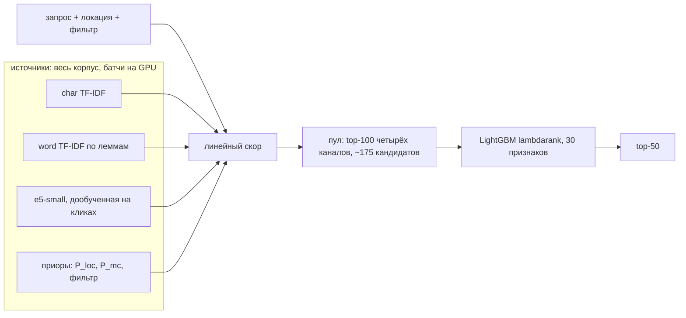

# Кандидатогенерация для поиска услуг Авито — итоги

Каждый раздел — отдельный слайд. Подробности и все эксперименты — в `README.md` и `EXPERIMENTS.md`.

## 1. Результат

- **Лидерборд: Recall@50 = 0,8963** (финальный сабмит s10).
- На холодной валидации (ближайшей к тесту): **0,9236**. Линейное слияние источников без ранкера (s3) давало 0,8967 на валидации и 0,8801 на лидерборде.
- Решение целиком офлайн, на одной видеокарте 8 ГБ. Воспроизводится одной командой `bash scripts/run_all.sh --clean` (2 ч 4 мин). При готовых моделях ответ повторяется побайтово.

| сабмит | что | холодная валидация | лидерборд |
|---|---|---|---|
| s3 | линейное слияние источников | 0,8967 | 0,8801 |
| s6 | + LightGBM-ранкер пула | 0,9196 | 0,8912 |
| s9 | ранкер без признаков истории и «качества» объявления | 0,9154 | 0,8917 |
| **s10** | **+ dense-модель на тексте с описанием объявления** | **0,9236** | **0,8963** |

## 2. Задача и данные

- 2 452 запроса бенчмарка; для каждого — до 50 объявлений из корпуса в 189 212 штук. Метрика — Recall@50.
- Обучение — 497 673 клика «запрос → объявление» из train.
- Что определило подход (EDA, `reports/eda.md`):
  - у 17% запросов в локации поиска нет ни одного объявления: это регионы-агрегаты. Сравнивать локации на равенство нельзя, нужна матрица переходов «локация поиска → локация объявления»;
  - 86% кликов текста запроса приходятся на одну подкатегорию;
  - фильтр «Вид/Тип услуги» есть у 67% строк train, но только у 37% запросов бенчмарка. Без перевзвешивания валидация переоценивает бонус за фильтр.

## 3. Валидация, повторяющая бенчмарк

- **Группа** = полный контекст поиска: текст, локация, фильтр, доставка, категория — аналог одного `query_id`.
- **Срезы:**
  - unseen — 5 000 текстов; все строки текста удалены из train;
  - seen — 1 500 групп; другие группы текста остаются.
- **Метрика решений `bench_adj`** — recall по 4 ячейкам (seen/unseen × фильтр есть/нет) с весами бенчмарка 0,210 / 0,164 / 0,159 / 0,466. Порог принятия изменения — +0,3 п.п.; при меньшей разнице выбирается более простой вариант.
- **Холодный вариант `ctx_cold`** появился после первых сабмитов, см. слайд 6.

Итоговый рецепт на холодной валидации (n ≥ 570 в каждой ячейке):

| ячейка | вес бенчмарка | recall | ±SE | n |
|---|---|---|---|---|
| seen, с фильтром | 0,210 | 0,9414 | 0,0077 | 930 |
| seen, без фильтра | 0,164 | 0,9316 | 0,0106 | 570 |
| unseen, с фильтром | 0,159 | 0,9315 | 0,0047 | 2 866 |
| unseen, без фильтра | 0,466 | 0,9101 | 0,0062 | 2 134 |
| **bench_adj** | | **0,9236** | 0,0038 | 6 500 |
| weighted | | 0,9281 | 0,0033 | 6 500 |

## 4. Пайплайн



1. **Скорится весь корпус, а не top-N текстового поиска.** Приоры сильно переставляют кандидатов: нужное объявление может быть 2 000-м по тексту, но единственным в городе запроса. Скоры считаются на GPU батчами по 512 запросов × 189 тыс. объявлений; в памяти хранится только top-k.
2. **Линейный скор:**
   ```
   cos_char + 0.61·cos_word + 0.5·cos_dense + 0.067·log(P_loc + 3e-6)
            + 0.012·log(P_mc + 8.6e-4) + 0.31·фильтр
   ```
   Веса подобраны Optuna на одной половине валидации и проверены на другой.
3. **Пул и ранкер.** Пул — объединение top-100 четырёх каналов (итоговый скор и char / word / dense с приорами); релевантное есть в пуле у 96% запросов. LightGBM-ранкер переставляет пул по 30 признакам: скоры и ранги каналов, приоры, совпадение фильтра, расстояние, цена.

## 5. Что дало прирост

Путь по этапам на исходной валидации:

| шаг | bench_adj | Δ, п.п. |
|---|---|---|
| baseline из ТЗ: char TF-IDF + P_loc + фильтр + P_mc | 0,8437 | — |
| очистка параметров от шума, описание объявления целиком | 0,8731 | +2,94 |
| word TF-IDF по леммам, подбор весов | 0,8852 | +1,21 |
| dense-модель, doc expansion | 0,9095 | +2,43 |
| e5-small, дообученная на кликах с hard negatives той же локации и подкатегории | 0,9177 | +0,82 |
| LightGBM-ранкер пула | 0,9377 | +1,99 |

После лидерборда (холодная валидация):
- **dense-документ с описанием объявления** (256 токенов вместо 128): +0,81 п.п. на валидации, +0,46 на лидерборде. Это самый сильный рычаг после ранкера: у новых объявлений нет истории кликов, и dense для них — главный сигнал (ранг в dense-канале — второй по важности признак ранкера).

## 6. Главный урок: валидация и лидерборд

- Первый ранкер показал 0,938 на валидации, а на лидерборде — 0,891. Разрыв −4,7 п.п.
- **Причина 1: «тёплые» релевантные.** Val-релевантные — объявления, которые кликали в train, и у 40% из них есть история в остатке train: expansion, популярность, пары для дообучения. В тесте релевантные в основном новые. **Решение:** холодная валидация `ctx_cold` — из остатка удалены все клики по val-релевантным. Разрыв линейного слияния с лидербордом сократился с −3,8 до −1,7 п.п.
- **Причина 2: смещение «выживших».** Кликнутые в прошлом и до сих пор активные объявления раскручены: медиана отзывов 42 против 15 по корпусу. Ранкер выучил «качество» объявления. **Решение:** ранкер без признаков истории и «качества», обученный на холодной валидации. На тесте эти признаки оказались нейтральны (s6 0,8912 ≈ s9 0,8917).
- **Калибровка:** прирост холодной валидации переносится на лидерборд примерно на 50–60%. По этой оценке решалось, что стоит загружать; использовано 5 попыток из 7.

## 7. Что не сработало

| идея | результат |
|---|---|
| поиск только внутри «своих» локаций (вариант (b) ТЗ) | до −1,9 п.п.: полный перебор корпуса лучше |
| doc expansion запросами из логов | +1,75 на тёплой валидации, вред на холодной — выключен |
| гео-сглаживание P_loc, отдельные веса для регионов | +0,29 < порога 0,5 |
| перенос запросов на похожие объявления | от −0,07 до −1,2 |
| cross-encoder как признак ранкера | +0,34 ценой 73 мин обучения и скоринга |
| пул 200 вместо 100 | +0,16 к s10 < порога 0,3 |
| RRF и квоты вместо линейной суммы | от −0,1 до −2 |

## 8. Инженерия

- **Ресурсы:** RTX 3060 Ti 8 ГБ, 22 ГБ RAM. Матрицы «запросы × корпус» считаются только батчами, TF-IDF — на HashingVectorizer, без словаря в памяти.
- **Офлайн:** модели скачиваются один раз скриптом, дальше все запуски идут с `HF_HUB_OFFLINE=1`.
- **Время:** 2 ч 4 мин с нуля, из них 1 ч 51 мин — два дообучения dense-модели. Это отступление от цели «< 1 ч»: документ с описанием удвоил время обучения, но дал +0,46 на лидерборде. С готовыми моделями ответ строится за 4,5 мин.
- **Детерминизм:** разреженное умножение cuSPARSE во float32 давало шум в 7-м знаке. Его хватало, чтобы LightGBM обучался заново целиком, и два одинаковых запуска совпадали лишь на 95,5%. Текстовые скоры и kNN переведены во float64, top-k сделан детерминированным: ответ повторяется побайтово.
- **Всё логируется:** журнал `EXPERIMENTS.md` — одна строка на эксперимент, включая неудачные; все гиперпараметры лежат в `configs/default.yaml`.

## 9. Что дальше

1. **Dense крупнее:** дообучить e5-base на тексте с описанием. Это самый сильный рычаг; ожидается +0,5–1 п.п. на холодной валидации.
2. **Регионы-агрегаты** (17% бенчмарка) — самое слабое место: на этапе 4 recall 0,84 против 0,94 у городов. Нужны признаки распределения P_loc для ранкера или отдельная модель.
3. **Пул 200 + cross-encoder** поверх s10: в сумме около +0,5 п.п. на валидации, но дорого по времени.

## Как проверить

```bash
bash scripts/install.sh && bash scripts/download_models.sh   # один раз, с сетью
bash scripts/run_all.sh --clean                              # с нуля, офлайн -> answer.csv
```

Готовые модели лежат в архивах (`dist/`, см. раздел README «Архивы моделей»). С ними `bash scripts/run_all.sh` без `--clean` строит ответ за 4,5 мин.
